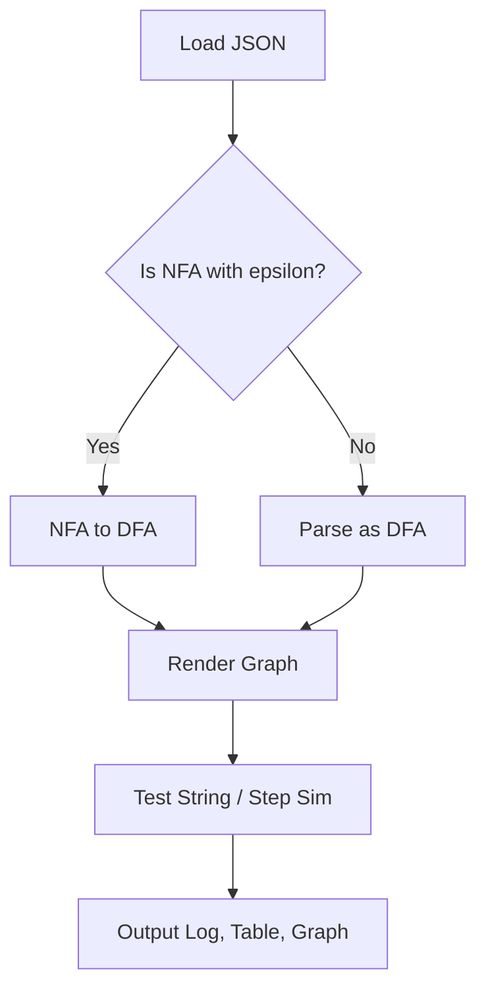
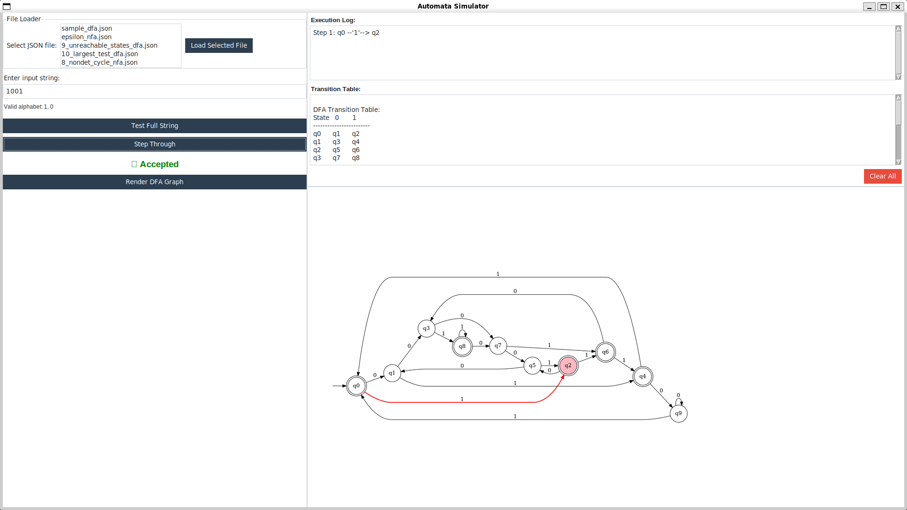

<div align="center">

# AUTOMATA-TOOL

*"Flexible automata tasking"*


</div>

## Features

* Load DFA or NFA (supports ε-transitions) from JSON
* Convert NFA → DFA using ε-closure + subset construction
* Test input strings (full or step-by-step)
* Visual step simulation with logs
* Print DFA transition table
* Render DFA as graph (`dfa_graph.png`)
* GUI with modern `ttkbootstrap` theme
* Designed for learning and teaching automata theory

## Environment Configuration

Ensure **Python 3.10** or newer is available on your system. Create and
activate a virtual environment before installing dependencies:

```bash
python3 -m venv venv
source venv/bin/activate
```

Graph rendering depends on the Graphviz toolkit (see below for install
instructions). After installing Graphviz, install the Python packages:

```bash
pip install -r requirements.txt
```

## Installation

> Graph rendering requires Graphviz

```bash
# Ubuntu/Debian
sudo apt install graphviz

# macOS
brew install graphviz
```

Install Python dependencies:

```bash
pip install -r requirements.txt
```

## Run the App

```bash
python ui/app.py
```

## Project Structure

```text
automata_tools/
├── dfa/
│   ├── dfa.py            # DFA logic
│   ├── from_nfa.py       # ε-NFA → DFA
│   ├── utils.py          # Table output
│   └── visualize.py      # Graph export
│
├── nfa/
│   └── nfa.py            # ε-transitions, closures
│
├── ui/
│   └── app.py            # Tkinter GUI
│
├── examples/
│   └── *.json            # DFA/NFA input files
│
├── demo/
│   └── *.png             # Screenshots, graphs
│
└── README.md             # Documentation
```

## JSON Input Format

Basic DFA:

```json
{
  "states": ["q0", "q1", "q2"],
  "alphabet": ["0", "1"],
  "transition": {
    "q0": {"0": ["q1"], "1": ["q0"]},
    "q1": {"1": ["q2"]},
    "q2": {}
  },
  "start_state": "q0",
  "final_states": ["q2"]
}
```

Use `"ε"` for epsilon transitions:

```json
"q0": { "ε": ["q1", "q2"] }
```

## User Workflow

1. Configure the environment and install dependencies as shown above.
2. Launch the GUI:

   ```bash
   python ui/app.py
   ```

3. Use the interface to:
   * Load `.json` examples
   * **Test Full String** – evaluate entire strings
   * **Step Through** – simulate one input at a time
   * **Render DFA Graph** – create a visualization
   * **Clear All** – reset the UI

The right panel shows the DFA graph, execution log and transition table.

## DFA Construction Flow



## Screenshots




## Testing Tips

* Add more `.json` to `examples/`
* Try:

  * Unreachable states
  * ε-loops, nondeterminism
  * Unknown symbols in input

## System Architecture


## License

**MIT License**
Developed by **Bui Quang Minh**
Vietnamese-German University · Class of 2023 (CSE)
