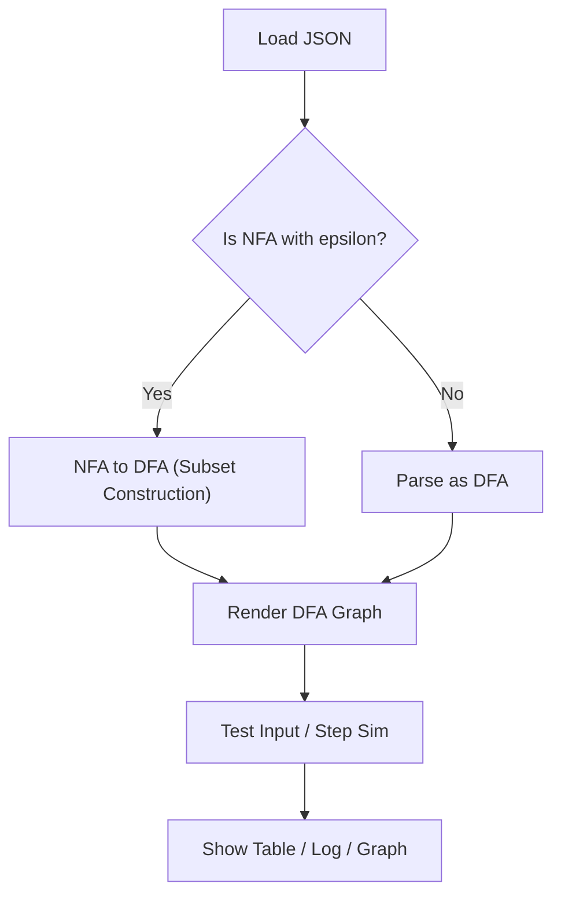
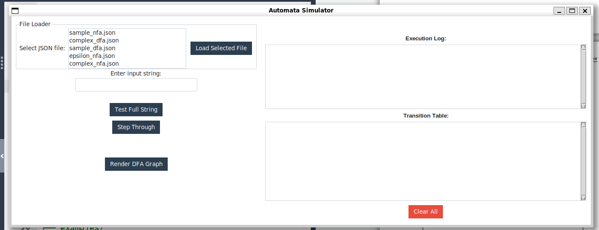
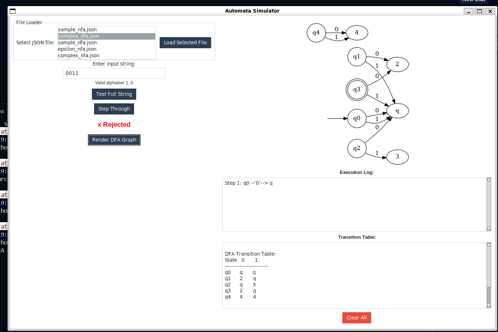
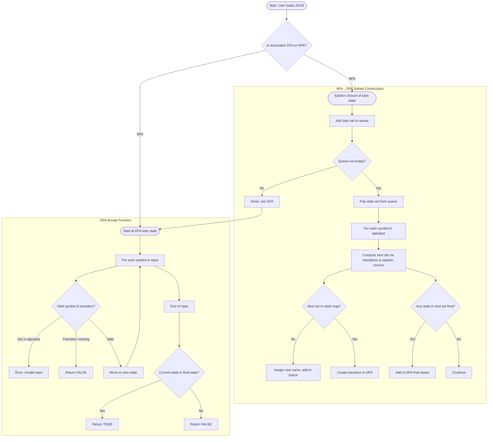

# 🧠 Automata Simulator

A Python-based interactive visual tool for simulating and converting finite automata (DFA/NFA with ε-transitions) via a clean GUI using `ttkbootstrap`.

---

## ✨ Features

- ✅ Load DFA or NFA (supports ε-transitions) from JSON format  
- 🔄 Automatically convert NFA → DFA (subset construction + ε-closure)  
- 🔍 Test input strings for acceptance (instant or step-by-step)  
- 🪜 Step simulation with real-time state tracking log  
- 🧮 Render readable DFA transition table  
- 🌐 Visualize DFA structure as a graph (`dfa_graph.png`)  
- 🖥️ Responsive GUI using modern `ttkbootstrap` theme  
- 🎓 Built for educational use in automata theory  

---

## 📦 Installation

Ensure Graphviz is installed for graph rendering:

```bash
# Ubuntu/Debian
sudo apt install graphviz

# macOS
brew install graphviz
```

Install Python dependencies:

```bash
pip install -r requirements.txt
```

---

## ▶️ Run the App

```bash
python ui/app.py
```

---

## 📁 Project Structure & File Functions

```text
automata_tools/
├── dfa/
│   ├── dfa.py            # DFA logic: transitions, acceptance check
│   ├── from_nfa.py       # NFA → DFA conversion (ε-handling)
│   ├── utils.py          # Helper: print DFA transition table
│   └── visualize.py      # Uses Graphviz to export DFA as PNG
│
├── nfa/
│   └── nfa.py            # NFA logic: ε-transitions, move, closure
│
├── ui/
│   └── app.py            # GUI (Tkinter + ttkbootstrap)
│                         # - File loader
│                         # - String testing / step sim
│                         # - DFA graph + table viewer
│
├── examples/
│   ├── sample_dfa.json   # Sample DFA definition
│   ├── complex_nfa.json  # NFA with ε-transitions
│   └── *.json            # Additional automata
│
├── demo/
│   └── *.png             # Screenshots / DFA graphs
│
└── README.md             # This documentation
```

---

## 📂 JSON Format

Example DFA input:

```json
{
  "states": ["q0", "q1", "q2"],
  "alphabet": ["0", "1"],
  "transition": {
    "q0": {"0": ["q1"], "1": ["q0"]},
    "q1": {"1": ["q2"]},
    "q2": {}
  },
  "start_state": "q0",
  "final_states": ["q2"]
}
```

For ε-transitions in NFAs, use:

```json
"q0": { "ε": ["q1", "q2"] }
```

---

## 🧑‍💻 User Guide

Run the app:

```bash
python ui/app.py
```

Use the left pane:
- Select a `.json` file from the list (in `examples/`)
- Click **Load Selected File**

Input your string (e.g., `0101`) and use buttons:
- 🔍 **Test Full String** – DFA acceptance instantly
- 🪜 **Step Through** – one symbol at a time
- 🌐 **Render DFA Graph** – shows image inline
- ❌ **Clear All** – reset the interface

The right pane shows:
- 🖼 DFA graph
- 📜 Execution log
- 📋 DFA transition table

---

## 📊 DFA Construction Architecture



---

## 📸 Screenshots

```markdown



```

---

## 🧪 Bonus / Testing Tips

- Add new `.json` files to the `examples/` folder
- Try edge cases:
  - Unreachable states
  - ε-loops or nondeterminism
  - Invalid characters

---

## 🛠 Technical Highlights

- `ttkbootstrap` for a modern UI look
- `graphviz` to visualize DFA state machines
- `Pillow` (PIL) to render graph image inside GUI
- Automatic detection of DFA/NFA
- Modular core logic, usable outside GUI

---

## 📊 Master Architecture


## 📜 License

**MIT License**  
Developed by **Bui Quang Minh**  
Vietnamese-German University | Course: CSE2023
